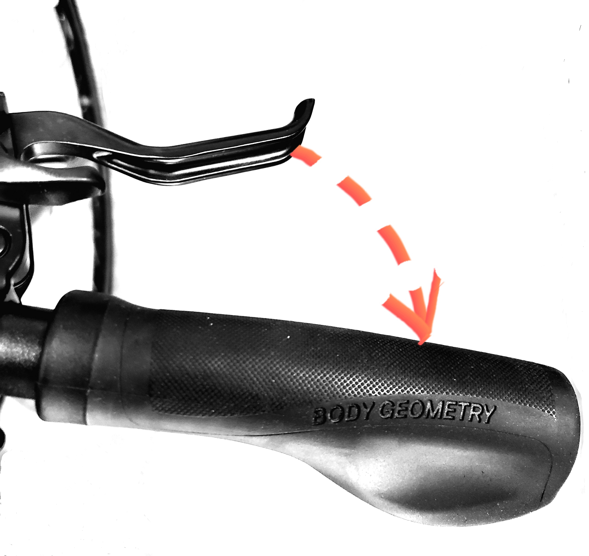

# Data, Code, and Models
Data, Code, and Models is a collection of articles on data science, software engineering, and mathematics.
## Agenda:
## 1 - Software Design, Mechanical Design, and Bikes!
### By Ahmed Ragab Nabhan, PhD
It is safe to say that if you are a software designer or a developer, then you are familiar with a well known design principle in software design that is called the [Law of Demeter (LoD)](https://en.wikipedia.org/wiki/Law_of_Demeter), or The Principle of Least Knowledge. As a software developer, occasionnaly you encounter violations of this principle when dealing with existing code bases either in work environment or in open source code bases. For example, a function code can be cluttered with a long chain of other function calls to get a value calculated based on some parameters. In another scenario, a function can make calls spanning multiple modules, vertically. This violates at least one principle of good software desgin, that is of least knowledge. A good example of this chaining practice can be found [in this interesting article](https://hackernoon.com/object-oriented-tricks-2-law-of-demeter-4ecc9becad85).

## Coding and Biking
It is interesting to recognize common principles between physics, information sciences and software engineering in particular. For example, information entropy and classical entropy in statistial mechanics are both related to degree of disorder or randomness in a system. Because I practice coding on a daily basis, and biking and skating over weekends, I keep thinking about relationship between the abstract and the physical, other than the need to stay fit after working long hours coding or debugging. Biking and skating are the kind of sports that can bring you down to earth (literally) when it comes to recognizing the effects of forces and mechanical principles. Out of passion for good design practices, I seek knowledge about design principles  outside the software engineering and data engineering domains. One day, I came across a lecture note on the [principles of mechanical design](https://downloads.deusm.com/designnews/FundamentalDesignPrinciplesKCC10-24-2011.pdf) by K. Craig. This lecture covers a set of concepts of mechanical design. One interesting concept is called locally closed load paths. It was interesting to demonstrated the idea of load paths by an example using bicycle brakes.

Think for a moment about how you use the handbrakes while riding a bike. You squeeze the hand brake and that does the magic of stopping the wheels from rolling. Let's do this mental exercice to be more mindful about what happens when we squeeze the brakes. 

 Locally closed load paths on the brake of a bicycle 

Instead of pulling or pushing (like a car handbrake for instance), the action of squeezing enables a locally closed load path and this is more stable (and safe!). Imagin what would happen if the braking mechanism is to pull the brakes instead of squeezing it. That would mean the load path would extend to your arm, back, seat, and bike frame, something that would make braking a horrifying, unstable experience. 

## What does this have to do with a good software design?
This hypothetical instability we may experience with long load path in a virtual hand brake with pulling instead of squeezing can be real when we deal with a badly designed software. Making long chain of method calls to get a piece of data that we need to implement a funcion is similar to long load path in mechanical design and should be avoided by all means. It can be important to recognize these long load paths in software systems and try our best to fix this design flaw. 

It is worthnoting that this long load path phenomenon does not only apply to software design and implementation. In fact, it can be observed during any bad user experience where users of a software product get frustrated while navigating through long chains of menu items to find what they look for. In early days of smart phones, some manufacturers made it hard for customers to find a contact number on thier phones. In data engineering, some data pipelines can be designed in a way that manifest the long load path, sorces consumers to dive deeply to perform a required data aggregation. My take on this issue is to rethink the design of software while enjoying your bike ride!  
